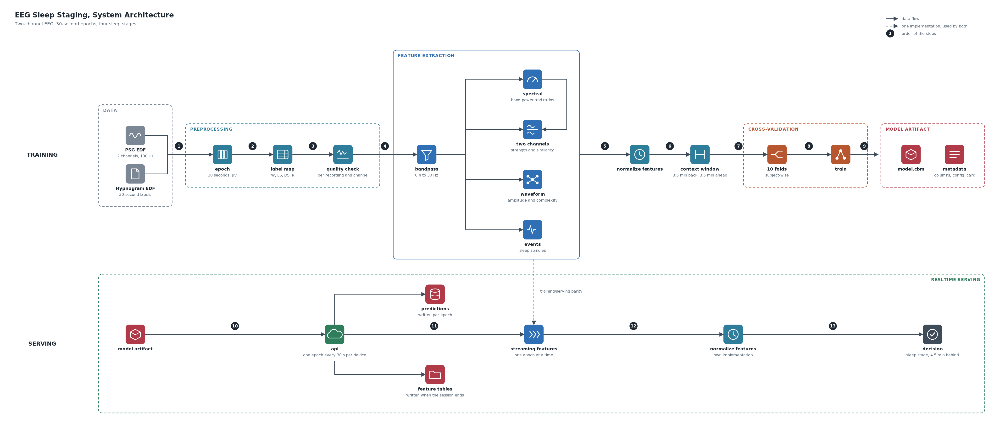
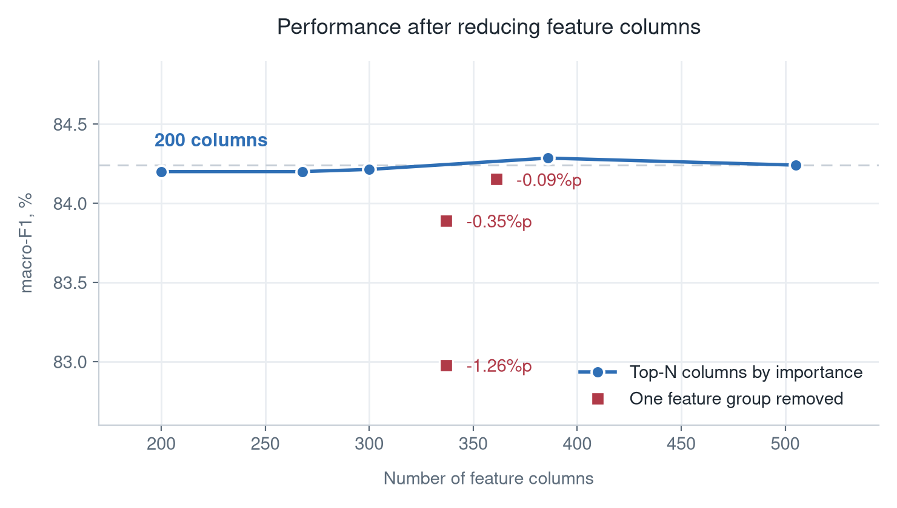

# EEG-Based Sleep Stage Classification

수면다원검사 판독은 사람이 하룻밤 약 1,000개 조각을 손으로 매깁니다. 이 프로젝트는
*Journal of Appropriate Technology* 에 게재한
[Machine Learning-Based Sleep Stage Classification Model Using Single-Channel EEG](https://www.e-jat.org/journal/view.php?doi=10.37675/jat.2025.00647)
를 고도화하는 파이프라인입니다.

논문은 뇌파 한 채널과 XGBoost 로 수면 단계를 4단계로 분류했습니다. **같은 데이터셋과
같은 4단계 문제를 유지하면서** 세 가지를 개선했습니다.

| | 기존 논문 | 이번 작업 |
|---|---|---|
| **분류 성능** | macro-F1 68.67%, REM 43.97% | macro-F1 85.09%, REM 79.98%. 각각 16.42%p 와 36.01%p 개선 |
| **판정 시점** | 녹음 종료 후 일괄 판정 | 수면 중 4.5분 지연 판정. 열마다 필요한 대기 시간을 기록 |
| **입력과 계산량** | 뇌파 한 채널 | 뇌파 두 채널. 특징을 505개에서 200개로 축소 |

## System Architecture



학습은 원본 EDF 두 개에서 시작합니다. 신호 파일과 판독 파일을 짝지어 30초 조각과
4단계 라벨을 만들고, 채널 품질을 검사해 쓸 수 없는 녹음을 걸러냅니다. 남은 조각에
대역 필터를 건 뒤 주파수, 두 채널 비교, 파형, 사건 네 갈래로 특징을 뽑습니다. 그
값을 정규화하고 앞뒤 문맥을 붙여 피험자 단위 10겹으로 학습하면 모델 파일과 열 순서,
설정이 함께 나옵니다.

서빙은 그 모델 파일을 읽는 것으로 시작합니다. API 가 기기에서 30초마다 올라오는
조각을 하나씩 받아 학습과 같은 특징 계산을 돌리고, 정규화한 뒤 수면 단계를 냅니다.
**답을 내기 전에 단계 전이 후처리를 겁니다.** 지금까지 지나온 흐름만 보므로 판정이
더 밀리지 않습니다. 판정은 조각마다, 특징 표는 세션이 끝날 때 저장됩니다.

**두 줄을 잇는 점선은 특징 계산 코드를 공유한다는 표시입니다.** 학습에서 쓴 계산과
서빙에서 쓴 계산이 갈라지면 오류 없이 성능만 떨어지기 때문에, 구현을 하나로 두어
그 상황이 생기지 않게 했습니다.

## Performance

CatBoost, subject-wise 10-fold cross-validation 입니다. 한 클래스만 답하는 기준선은 macro-F1 12.6%입니다.

| F1, % | macro | W | LS | DS | R |
|---|---:|---:|---:|---:|---:|
| **이번** | **85.09** | 92.96 | 87.30 | 80.13 | 79.98 |
| 논문 | 68.67 | 92.52 | 78.72 | 59.48 | 43.97 |
| **개선** | **+16.42** | +0.44 | +8.58 | +20.65 | +36.01 |
| 다수 클래스 기준선 | 12.6 | 50.4 | 0.0 | 0.0 | 0.0 |


**깊은잠과 REM 에서 개선이 컸습니다.** 이 둘이 전체 조각의 20%뿐인 드문 클래스라
클래스를 동등하게 보는 macro-F1 에서 비중이 큽니다.

## Repository Structure

```
src/sleepstage/
  core/        신호 처리와 특징 계산
  experiment/  전처리, 품질 검사, 교차검증, 특징 선택, 후처리
  serving/     실시간 추론 API 와 조각 단위 스트리밍
configs/       전처리, 특징, 학습, 품질 검사 설정
scripts/       실행 기록에서 표와 그림을 만드는 도구
tests/         실행해도 오류가 안 나는 종류의 버그를 고정하는 시험
artifacts/     배포용 모델과 열 순서
```

**특징을 계산하는 코드는 `src/sleepstage/core/` 에 있고 학습과 서빙이 둘 다 불러
계산합니다.**

## Data

**Sleep-EDF Expanded 1.0.0 의 Sleep Cassette** 부분입니다. 집에서 24시간 연속으로 잰
건강한 성인의 수면다원검사이고
[PhysioNet](https://physionet.org/content/sleep-edfx/1.0.0/) 에서 받습니다.
**내려받는 명령과 폴더 구조는 [`data/README.md`](data/README.md) 에 정리해 두었습니다.**

**분할은 파일이 아니라 피험자 단위입니다.** 78명이 153개 녹음을 만들고 75명이 2박씩
잤기 때문에, 파일로 나누면 같은 사람이 학습과 평가 양쪽에 들어갑니다.

**한 채널의 조각 중 진폭 20 µV 미만이 20%를 넘는 녹음 2건은 뺐습니다.**

| 항목 | 값 |
|---|---|
| 피험자 | 78명, 25세부터 101세 |
| 녹음 | 151개 |
| 채널 | EEG Fpz-Cz, EEG Pz-Oz 두 개 |
| 조각 | 30초, 193,285개 |
| 클래스 | W 33.9 / LS 46.2 / DS 6.7 / R 13.2 % |

## Reproduction

Python 3.12, numpy 2.5, scipy 1.18, mne 1.12, scikit-learn 1.9, CatBoost 1.2.10.

```bash
uv pip install -e ".[boosting-full,tracking,analysis,dev]"

sleepstage prepare  --config configs/preprocess/base.yaml --jobs 8
sleepstage quality  --config configs/quality.yaml
sleepstage features --config configs/features/base.yaml --jobs 8
sleepstage split    --features data/features/<해시>.parquet \
                    --out data/splits/subject_10fold.json
sleepstage train    --config configs/experiment/base.yaml \
    --set train.features=data/features/<해시>.parquet \
    --set train.feature_select=top:200 \
    --set train.quality_report=data/interim/epochs/quality.json
sleepstage postprocess --run runs/improve/<실행>
sleepstage export   --config configs/experiment/base.yaml --out artifacts/model-v1 \
    --set train.features=data/features/<해시>.parquet \
    --set train.feature_select=top:200 \
    --set train.quality_report=data/interim/epochs/quality.json \
    --metrics runs/improve/<실행>/metrics.json \
    --transitions runs/improve/<실행>/transitions.json
```

`<해시>` 는 `sleepstage feature-path --config configs/features/base.yaml` 이 알려줍니다.
데이터를 받는 방법은 [`data/README.md`](data/README.md) 에 있습니다.
## Features

| 무리 | 내용 |
|---|---|
| 주파수 | 대역별 세기, 대역 사이 비율, 두 채널 사이 비율 |
| 파형 | 진폭, 복잡도, 5초 조각별 최댓값과 최솟값 |
| 사건 | 수면 방추 개수와 지속 시간 |
| 문맥 | 앞뒤 3.5분 평균, 최근 2분 평균 |


### Feature Pruning



가로축은 모델에 넣은 열의 개수이고 세로축은 macro-F1 입니다.

**파란 점은 중요도가 높은 순으로 상위 몇 개만 남긴 것입니다.** 어느 열이 중요한지는
묶음마다 그 묶음의 학습 데이터만 보고 정하므로 평가 데이터를 미리 보지 않습니다.

**빨간 네모는 성격이 같은 열을 한 무리씩 통째로 뺀 것입니다.** 예를 들어 최근 2분
평균에 해당하는 열 전부, 또는 평활하지 않은 원본 값 전부를 빼는 식입니다.


505개에서 200개까지 줄이는 동안 파란 점이 거의 움직이지 않습니다. 묶음별로 짝지은 차이가
0.08%p 이고 윌콕슨 p=0.557 이라, **열을 60% 줄여도 성능이 나빠졌다고 말할 수 없다고
판단했습니다.** 기기에서 돌릴 것을 생각해 200개를 최종 구성으로 정했습니다.

## Model

모델을 고르는 실험이라 전처리와 특징을 한 조건으로 고정하고 모델만 바꿨습니다.
0.4에서 30 Hz 대역 필터, 과거만 보는 정규화, 앞뒤 3.5분 평균 문맥, 289개 열입니다.
**최종 구성보다 열이 적고 후처리도 걸지 않아서 아래 숫자는 위의 성능 표와 다릅니다.**

| 모델 | macro-F1 |
|---|---:|
| CatBoost | 83.8 |
| XGBoost | 83.6 |
| HistGB | 83.4 |
| LightGBM | 83.3 |
| LSTM, 창 9개 | 82.6 |
| 로지스틱 회귀 | 81.1 |
| CNN, 조각 1개 | 79.1 |

부스팅 구현 네 개가 0.5%p 안에 모여 있어서 숫자만으로는 고를 수 없었습니다. 그래서
뇌파 데이터의 성질을 놓고 세 가지를 봤습니다.

1. 수면 방추는 대부분의 조각에서 한 번도 나타나지 않아, 방추 관련 열은 값이 정의되지
   않는 경우가 많습니다. 평균으로 채우면 없던 사건을 지어내는 것이고 그 행을 버리면
   조각 10,368개가 통째로 빠집니다. CatBoost 는 결측을 값의 한 종류로 다뤄서 채우지도
   버리지도 않습니다.

2. 같은 얕은잠이라도 진폭이 사람에 따라 두 배 넘게 차이 납니다. 트리 모델은 값의
   크기가 아니라 순서만 보기 때문에 이 개인차에 덜 흔들린다고 판단했습니다.

3. 절대 상관 0.9를 넘는 열 짝이 596개입니다. CatBoost 는 한 깊이에서 모든 가지가 같은
   기준으로 갈라지는 대칭 트리를 쓰는데, 이 구조가 규제처럼 작용해 닮은 열이 많을 때
   과적합이 덜한 것으로 알려져 있습니다.

## Evaluation


**성능의 대부분은 모델이 아니라 신호와 문맥에서 나옵니다.** Fpz-Cz 채널을 빼고 Pz-Oz
하나만 쓰면 5.6%p, 앞뒤 3.5분 문맥을 빼면 3.2%p 잃습니다. 부스팅을 선형 모델로
바꾸는 것은 2.7%p 이고 대역 필터는 0.8%p 입니다. 이 결과를 보고 **모델을 더 손보는 것보다 무엇을 입력으로 줄지를 먼저
정하는 편이 낫다고 판단했습니다.**

## Real-Time Design

### Why It Has to Run During Sleep

수면 중 개입은 특정 단계에서만 효과가 있습니다. 서파에 맞춘 청각 자극은 깊은잠에서만,
악몽 장애 기기와 렘수면 행동장애 감시는 REM 에서만 성립합니다. 아침에 나오는 판정으로는
이런 개입을 할 수 없습니다.

**지연을 4.5분까지 늘리는 근거는 주로 REM 입니다.** 미래를 아예 보지 않게 하면 W 는
오히려 0.03%p 좋아지고 DS 는 0.28%p 나빠지는데, R 은 2.24%p 떨어집니다. 각성과
깊은잠은 그 30초 안에 증거가 대부분 들어 있는 반면, REM 은 앞뒤를 봐야 얕은잠과
갈리기 때문입니다.

### Where the 4.5 Minutes Comes From

필터가 무는 앞뒤 2조각과 맥락 창의 미래 절반 7조각을 더한 값입니다. 조각이 30초이므로
9조각이 4.5분입니다. **보고하는 지연에 필터가 무는 시간을 포함시켰고, 이것이 빠지지
않도록 테스트로 고정했습니다.**
