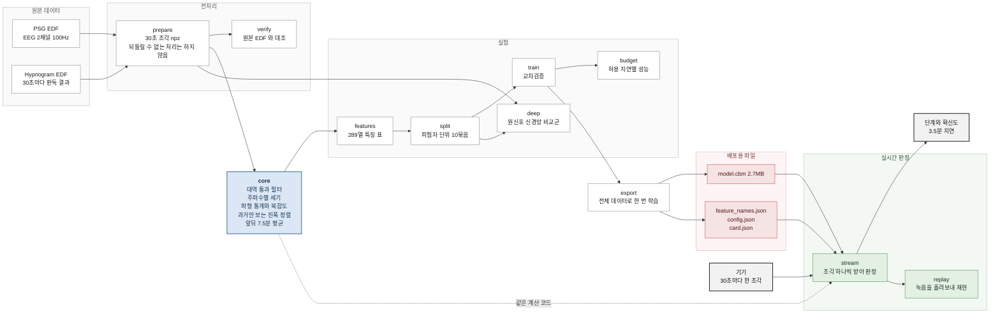
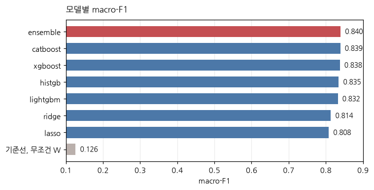
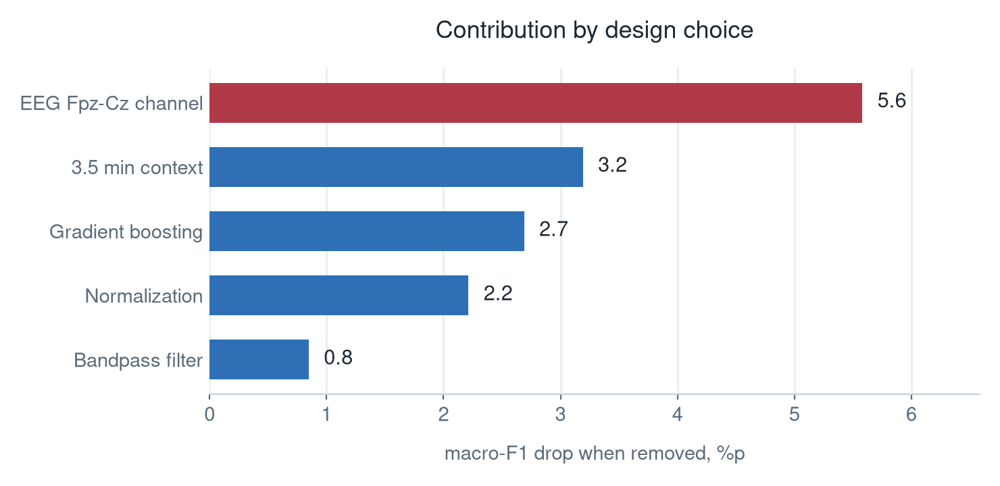

# EEG 수면 단계 분류

뇌파 2채널만으로 30초마다 수면 단계를 판정합니다.
전처리부터 학습, 평가, 실시간 판정까지 하나의 파이프라인으로 묶었습니다.

```
데이터    Sleep-EDF Expanded, 건강한 성인 78명 153녹음, 절단 후 195,479 조각
입력      EEG Fpz-Cz, EEG Pz-Oz 두 채널, 100Hz
출력      W 깨어있음 / LS 얕은잠 / DS 깊은잠 / R 렘수면
평가      피험자 단위 10묶음 교차검증
성능      macro-F1 0.839, 정확도 0.872, kappa 0.800
속도      조각 하나당 13ms, 30초 예산의 0.05%
```

한 클래스만 답하는 기준선이 macro-F1 0.126 입니다.

---

## 무엇을 목표로 잡았나

**웨어러블에 넣을 수 있을 것, 실시간으로 답할 것, 계산이 쌀 것.**

이 세 가지가 선택을 전부 결정했습니다.
채널을 EEG 두 개로 제한한 것은 이마에 붙이는 기기가 안구운동과 근전도를 얻기 어렵기 때문입니다.
특징마다 계산에 필요한 미래 시간을 기록해 둔 것은 허용 지연을 정하면 쓸 수 있는 특징이
자동으로 걸러지게 하기 위해서입니다.
부스팅 트리를 주 모델로 삼은 것은 모델 파일이 2.7MB 이고 추론이 2ms 이기 때문입니다.

---

## 파이프라인



**`core` 를 학습과 서빙이 함께 쓰는 것이 이 구조의 핵심입니다.**
특징 계산을 두 벌 두면 두 값이 조용히 갈라집니다. 한 벌만 두어 그것을 막았습니다.

---

## 결과

<!-- 결과: scripts/experiment_table.py --readme 가 만듭니다. 손으로 고치지 마세요 -->

| | macro-F1 | 정확도 | kappa | W | LS | DS | R | 평가 조각 |
|---|---:|---:|---:|---:|---:|---:|---:|---:|
| **특징을 더한 catboost** | **0.846** | **0.872** | **0.807** | **0.925** | **0.868** | **0.794** | **0.797** | 185,111 |
| catboost | 0.838 | 0.866 | 0.797 | 0.925 | 0.861 | 0.789 | 0.777 | 195,441 |
| xgboost | 0.836 | 0.865 | 0.794 | 0.922 | 0.862 | 0.797 | 0.764 | 195,441 |
| histgb | 0.834 | 0.861 | 0.789 | 0.919 | 0.856 | 0.791 | 0.769 | 195,441 |
| lightgbm | 0.833 | 0.861 | 0.790 | 0.921 | 0.856 | 0.786 | 0.769 | 195,441 |
| ridge | 0.811 | 0.841 | 0.764 | 0.916 | 0.832 | 0.752 | 0.745 | 195,441 |
| 기준선, 한 클래스만 답하기 | 0.126 | 0.337 | 0.000 | 0.504 | 0.000 | 0.000 | 0.000 | 195,441 |

<!-- 결과 끝 -->




---

## 무엇과 비교해서 골랐나

선택마다 무엇과 비교했고 무엇을 잃었는지를 남겼습니다.

| 축 | 비교한 것 | 결과 | 고른 것과 대가 |
|---|---|---|---|
| 시간 문맥 | 없음 / 앞뒤 값 붙이기 / 앞뒤 평균 | **+3.3%p** | 앞뒤 평균. 값 붙이기와 성능이 같은데 열이 481개에서 289개로 줄어듦 |
| 모델 | 선형 2종, 부스팅 4종 | **+2.6%p** | catboost. 부스팅끼리는 0.5%p 안쪽이라 사실상 무엇을 골라도 같음 |
| 정규화 | 없음 / 과거만 보고 맞추기 | **+2.1%p** | 과거만 보는 방식. 미래를 안 보므로 실시간에서도 같은 값이 나옴 |
| 채널 | 두 채널 / 이마만 / 뒤통수만 | **이마 −5.4%p** | 두 채널. 이마 하나만 남기면 1.8%p 손해로 그침 |
| 필터 | 없음 / 과거만 / 앞뒤 | **+0.8%p** | 앞뒤 보는 필터. 과거만 보는 필터와 0.3%p 차이 |
| 하이퍼파라미터 | 무작위 탐색 8조합 | **0.5%p 미만** | 기본값. 조정해서 얻는 것이 거의 없음 |
| 특징 수 | 20 / 50 / 100 / 200 / 289 | **100개면 −0.3%p** | 계산을 줄여야 하면 100개로 충분 |
| 허용 지연 | 0분 / 2분 / 4분 / 무제한 | **즉시 답하면 −0.84%p** | 지연을 얼마나 허용할지에 따라 고를 수 있음 |



**모델을 무엇으로 고르느냐보다 입력을 어떻게 만드느냐가 큽니다.**
채널과 시간 문맥과 정규화를 합치면 10%p 가 넘고, 모델 종류로 얻은 것은 2.6%p 입니다.

---

## 데이터 누수를 어떻게 막았나

EDFX 는 78명이 153개 녹음을 만듭니다. **75명이 2박씩 녹음했습니다.**
파일 단위로 나누면 같은 사람의 1일차가 학습에, 2일차가 평가에 들어갑니다.
같은 사람의 뇌파는 밤이 달라도 매우 비슷하므로 성능이 부풀려집니다.

그래서 **분할 키를 파일명이 아니라 피험자 번호로 잡고, 배정을 파일로 고정했습니다.**
모든 실험이 같은 파일을 읽으므로 비교 대상 사이에 분할 차이가 생기지 않습니다.

정규화도 같은 이유로 과거만 보도록 만들었습니다.
밤 전체를 보고 기준을 잡으면 아직 오지 않은 시간의 정보가 섞입니다.

---

## 핵심 인사이트

분석이 끝나면 채웁니다.

---

## 실시간 판정

학습할 때는 밤 전체를 한꺼번에 놓고 계산하지만 실제 기기는 조각을 하나씩 보냅니다.
같은 답이 나오도록 조각 단위로 다시 계산하는 경로를 따로 만들었습니다.

```
한꺼번에 계산한 결과와 조각씩 계산한 결과   839조각 전부 일치
조각 하나 처리 시간                        특징 11.7ms + 추론 1.7ms
p95 지연                                   55ms
모델 파일 크기                             2.7MB
판정 지연                                  3.5분, 앞뒤 평균이 뒤쪽을 보기 때문
```

학습과 서빙이 특징 계산 코드를 공유합니다.
계산을 두 벌 두면 두 값이 조용히 갈라지는데, 그것을 구조로 막았습니다.

---

## 재현

원본 데이터는 저장소에 없습니다. PhysioNet 에서 받습니다.

```bash
wget -r -N -c -np https://physionet.org/files/sleep-edfx/1.0.0/sleep-cassette/
```

```bash
uv pip install -e ".[boosting-full,tracking,analysis,deep,dev]"
git config core.hooksPath .githooks

sleepstage prepare  --config configs/preprocess/base.yaml --jobs 8
sleepstage verify   --config configs/preprocess/base.yaml
sleepstage features --config configs/features/base.yaml --jobs 8
sleepstage split    --features data/features/<해시>.parquet --out data/splits/subject_10fold.json

sleepstage sweep --config configs/sweeps/preprocess.yaml
sleepstage sweep --config configs/sweeps/models.yaml
sleepstage sweep --config configs/sweeps/feature_additions.yaml
sleepstage sweep --config configs/sweeps/feature_pruning.yaml
sleepstage sweep --config configs/sweeps/deep_windows.yaml
```

배포용 모델 파일을 만들고 실시간 판정을 재현합니다.

```bash
F=$(sleepstage feature-path --config configs/features/base.yaml \
  --set features.filter=zerophase --set features.context=smooth)
sleepstage export --config configs/experiment/base.yaml --set train.features=$F \
  --set train.model=catboost --set train.drop_missing=true --out artifacts/model-v1
sleepstage replay --artifact artifacts/model-v1 --npz data/interim/epochs/SC400N1.npz
```

무엇을 실행하든 **`--limit` 로 몇 개만 먼저 돌려보고 전체로 넓히는 것**을 권합니다.
전체를 돌리는 시간보다 잘못 돌린 것을 알아채는 시간이 더 비쌉니다.

---

## 저장소 구조

```
src/sleepstage/
├── core/            신호에서 특징을 계산합니다. 학습과 서빙이 함께 씁니다
├── experiment/      데이터 준비, 학습, 평가
│   └── deep/        원신호를 그대로 넣는 신경망 비교군
└── serving/         저장된 모델로 판정합니다. core 만 쓰고 experiment 를 모릅니다

configs/             전처리, 특징, 학습 설정
configs/sweeps/      실험 묶음마다 하나씩
notebooks/           결과 시각화와 오차 분석
tests/               조용히 틀리는 것만 골라 담았습니다
```

테스트는 실행하면 바로 아는 오류가 아니라 **에러 없이 성능만 나빠지는 종류**를 잡습니다.
시간축 부호가 뒤집히거나, 정규화가 미래를 보거나, 채점 범위가 어긋나는 경우입니다.

---

## 한계

**4단계로 합쳤습니다.** N1 과 N2 를 LS 하나로 묶었기 때문에 이 분야에서 가장 어려운 경계가
사라졌습니다. **5단계로 보고하는 문헌과 직접 비교할 수 없습니다.**

**건강한 성인만 학습했습니다.** 수면장애 환자에서는 검증되지 않았습니다.

**100Hz 2채널을 전제합니다.** 다른 기기에서는 진폭 분포가 달라집니다.

**깊은 잠이 전체의 6.7% 뿐입니다.** 고령 피험자가 많아 서파수면이 적습니다.
구간의 절반 이상이 30초 한 칸이라, 이 클래스의 점수는 다른 데이터셋에서 달라질 수 있습니다.

**wake 절단 경계를 정답 라벨로 정했습니다.** 취침 시 착용을 전제한 것이고,
착용 시점을 모르는 상황에서는 다시 검토해야 합니다.
